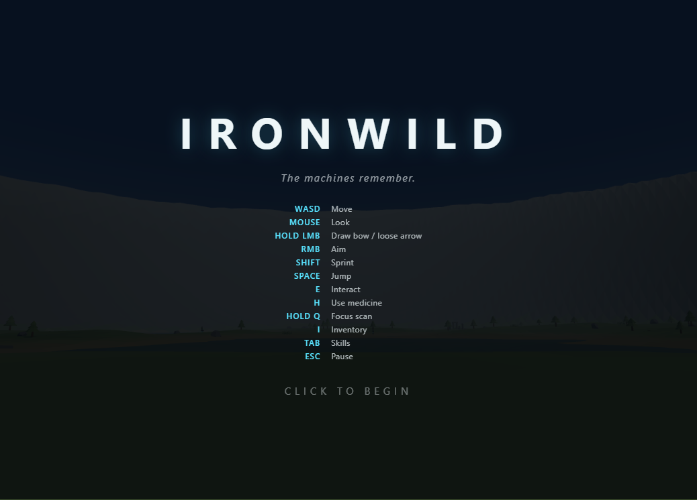

# IRONWILD

An original open-world machine-hunting action prototype for the browser, built with
**Three.js 0.166** and **Vite 5**. All assets are procedural — no downloads, no external
files. Every name, design, and line of code is original.



## Run it

```bash
npm install       # once
npm run dev       # development server (http://localhost:5173)
npm run build     # production build to dist/
npm run preview   # serve the production build (http://localhost:4173)
```

Quality gates (used in CI-style verification; see **Testing** below):

```bash
npm run lint      # eslint over sources and configs
npm test          # vitest unit tests (deterministic game logic)
npm run test:e2e  # builds, then drives the real game in Chromium
npm run verify    # all of the above, in order
```

Click the start screen to begin — the game grabs pointer lock for mouse-look.
Best played in Chrome/Edge/Firefox on desktop.

## How to play

You are a hunter in a valley reclaimed by wilderness and patrolled by animal-like
machines. Hunt them, break their glowing weak points, harvest resources, craft, and
grow your skills. Death is permanent per run — restart and try again.

| Input | Action |
|---|---|
| `W A S D` | Move |
| Mouse | Look |
| Hold LMB | Draw bow / release to loose |
| RMB (hold) | Aim (over-shoulder zoom) |
| Shift | Sprint |
| Space | Jump / swim up |
| Ctrl | Dodge roll (i-frames, costs stamina) |
| C | Crouch / sneak (concealed in tall grass) |
| F | Spear quick-melee (short-range swing, no ammo cost) |
| X | Toggle standard / fire arrows |
| E | Collect · interact · harvest (hold) |
| Q (hold) | Focus scan — slow motion, reveals machines & weak points through terrain |
| H | Use medicine (+45 HP) |
| I | Inventory & crafting |
| Tab | Skill tree |
| B | Bestiary |
| P | Quicksave |
| Esc | Pause |

### Machines

| Machine | Behavior | Weak points |
|---|---|---|
| **Skitter** | Fast quadruped scout; circles and leaps; alerts others | Optic ×2.5 |
| **Bramblehorn** | Deer-like grazer; flees, kicks if cornered; drops oil | Fuel sac ×2, back cell ×2 |
| **Rendclaw** | Raptor predator; chases and claws | Neck cable ×2.2 |
| **Ironmaw** | Heavy bruiser; telegraphed charge + spark bolts | Power core ×1.8 |
| **Duskwing** | Aerial dive-bomber; vulnerable while grounded | Wing membranes ×1.8 |
| **Bulwark** | Armored roller; front plate deflects arrows — flank it | Rear vents ×2.0 |
| **Vantage** | Peaceful tall scanner; focus-scan it to reveal the map (+2 skill points) | Uplink dish |
| **Mirefang** | Lake ambusher; lurks submerged (nostril tell) and lunges at swimmers | Eye ×2.2, belly seam ×1.6 |
| **the Monarch** | Colossal world-boss on a fixed far patrol loop; telegraphed AOE stomp + tail swipe, enrages every 25% hp lost | Chest furnace ×1.5, knee pistons ×1.8 |

Weak points take multiplied damage and **break** when depleted, staggering the machine
and changing behavior (blind scouts, crippled charges, grounded wings). ~15% of spawns
are **Alpha** variants: dark-red, tougher, harder-hitting, double loot. Downed machines
leave harvestable carcasses (hold E).

**Fire arrows** (craftable from oil) ignite machines — damage over time plus panic.
Arrows fly on a real ballistic arc — lead your targets and aim above for distance.

### World & progression

- **Biomes**: meadow, dense forest (NE), rocky highlands (S), lakeshore reeds.
- **Weather**: clear → breeze → rain → storms with lightning and thunder.
- **Contracts**: three rotating hunt/gather/scan contracts with rewards.
- **Day/night** (~8 min cycle), swim, crouch-stealth in tall grass, fall damage.
- **Crafting**: 5 arrows = 1 wood + 2 shards · fire arrows ×5 = 2 oil + 3 shards · medicine = 2 oil + 1 wood.
  Carcass harvest yields wood alongside shards/oil, so the economy has no hard ceiling.
- **Skills**: Heartier Frame, Steady Aim, Hunter-Killer, Scavenger, Second Wind, Deep Focus.
- **XP & levels**: kills, pickups, and scans grant XP; leveling up grants a skill point and a
  fanfare. A slim violet bar above the health meter tracks progress.
- **Contextual tips**: one-time on-screen hints teach focus-scan, medicine, stealth, fire
  arrows, storms, and contracts the first time each becomes relevant.
- **Bestiary** (key B): every species starts as "???"; scanning or fighting one reveals its
  name, killing it unlocks a one-line lore entry. Tracked and persisted independently of quests.
- **Hide armor**: carcass harvest also yields hide; spend it (+shards) in the inventory panel
  on two armor ranks that cut incoming damage 12%/22%.
- **Difficulty**: a Hardened mode (settings) scales every machine's outgoing damage and HP
  up at spawn — compounds with the Alpha variant roll for a harder run.
- **Accessibility**: a colorblind-safe weak-point cue (settings) draws a small pulsing
  white-on-black reticle over every unbroken weak point in range, all the time — not just
  during a focus scan, and independent of the glow color.
- **Save system**: autosave + P quicksave; Continue from the title screen. XP/level and the
  bestiary persist too; saves from earlier versions still load (missing fields default fresh).
- **Settings**: volume sliders, mouse sensitivity, invert-Y, quality preset, difficulty,
  colorblind cue (all persisted).
- **Minimap** with fog-of-war until you scan a Vantage.

### Rendering

A full post-processing pipeline (three.js `EffectComposer`) sits between the scene and the
screen: **GTAO** contact shadows (high quality only), **UnrealBloom** so every glowing weak
point/fire/lightning/sun-glow genuinely blooms instead of being a flat-shaded dot, a
screen-space **volumetric light shaft** pass (high quality only, see V6 below), **SMAA**
anti-aliasing, and a cinematic contrast/saturation/vignette/grain/chromatic-aberration grade,
finished by an `OutputPass` that applies the renderer's ACES filmic tone mapping exactly once.
The water plane gets a fresnel rim term (brighter at grazing angles) that samples the *live*
sky gradient and a sun glint, on top of its existing wave displacement and shoreline fade. All
of it is quality-scaled: `low` disables bloom/grain/aberration entirely, `medium` adds a
cheaper half-resolution bloom and reduced grain/aberration, `high` adds SMAA, GTAO and god
rays — the priciest passes.

V6 fidelity pass, layered on V5's pipeline: a screen-space **volumetric light shaft** pass
(the classic radial-sample "god ray" technique, aimed at the sun's live screen-space position
every frame) so low sun angles streak visibly through tree canopies and ruins; an atmospheric
**horizon haze** band in the sky dome shader; the **sky-reflective water fresnel** described
above; and a cinematic grade upgrade (animated film grain, edge chromatic aberration). All
new passes are gated to `high`; `medium`/`low` keep their cheaper pipelines.

## Project layout

```
index.html            entry page
src/main.js           boot + frame loop (system init order lives here)
src/core/             event bus, global state, input, math utils (shared foundation)
src/world/            terrain + biomes, sky/day-night, weather, props & pickups
src/player/           third-person controller (crouch/swim), camera rig, bow
src/combat/           arrow projectiles, status effects, hit FX
src/machines/         9 machine bodies (procedural) + AI state machine
src/systems/          save/load, hunt contracts, XP/leveling, bestiary
src/ui/               HUD, menus/settings, focus-scan overlay, minimap, colorblind cue
src/audio/            fully synthesized WebAudio SFX + adaptive music + ambience
tests/unit/           vitest suites for deterministic game logic
tests/e2e/            Playwright smoke suite driving the production build
ARCHITECTURE.md       v1 module contracts
ARCHITECTURE_V2.md    v2 upgrade contracts
ARCHITECTURE_V3.md    v3 upgrade contracts
docs/BALANCE.md       constants audit + applied balance fixes
screenshots/          canonical start-screen capture
```

## Testing

`npm run verify` runs the full gate: lint, unit tests, then a production build driven by
Playwright in a real browser. The E2E suite boots the game, starts a run, moves and fights,
opens every panel, saves and continues, and asserts a clean console (no errors, no autoplay
warnings) across the whole session. Unit tests cover the deterministic core — RNG, event bus,
damage/weak-point math, status timing, terrain generation, XP, quests, bestiary, and save
normalization (including corrupt-save handling).
